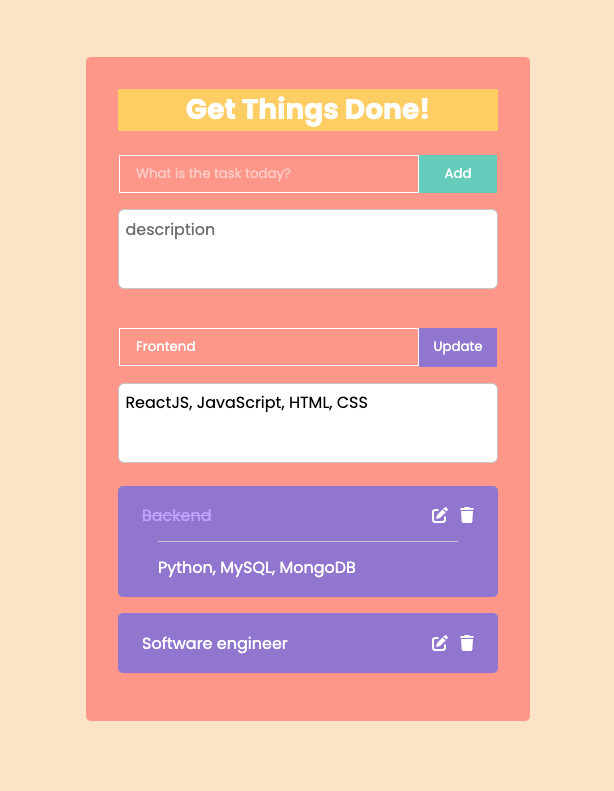

# To-do List built with React.JS
A simple but powerful To-do list App which is handly and easy to use.

## Features
* Allows users to edit topics and details after adding a todo.
* Used line-through text decoration instead of a check box.
* Given that it used localStorage instead of DB, it is lightweight and fast.

## Set up
1. Clone this project.
1. cd to the project directory and run `npm start`.
2. Open [http://localhost:3000](http://localhost:3000) to view it in your browser.

## Image of UI

